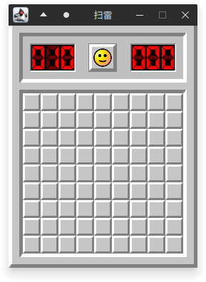
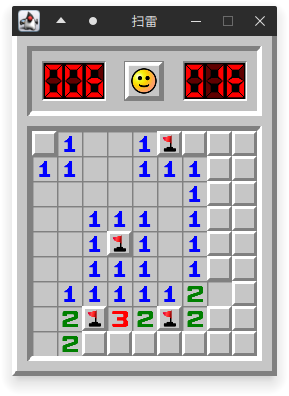
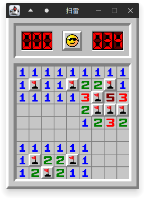
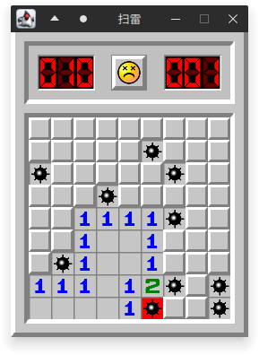

# minesweeper-assignment

这是本人大一下的 Java 课设作业，写了个简单的扫雷项目。主要的逻辑思路还是跟着[尚学堂的2小时扫雷课程](https://www.bilibili.com/video/BV13M4y1V7WQ/)走的，增加了亿点点 UI 上的改动以尽量还原 Windows XP 操作系统下的原版扫雷体验。图片素材是直接从[网页版的扫雷](https://minesweeper.online/)上扒的。

难度选择菜单没有做，因为使用 JMenuBar 下拉框时会被每 40ms 重绘一次的游戏主体界面挡住，干脆就没做了，简单加了一个命令行参数读取的自定义功能。

因为是赶 ddl 的产物，所以游戏整体或许还存在一些 bug，但我的课设答辩已经结束了，应该也就不会修复了。

本项目以 [MIT 协议](LICENSE)开源，非常自由，你甚至可以把它拿过来充当自己的课设，但请务必小心被发现。

以下是运行时的一些截图

